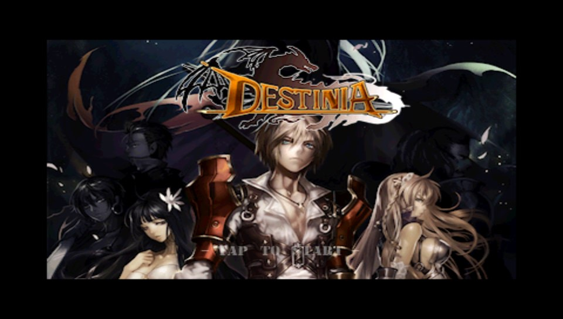

# Destinia Vita

<p align="center"></p>

This is a wrapper/port of <b>Destinia</b> for the *PS Vita*.

The port works by loading the Android ARMv6 executables from the Android release in memory, resolving their imports with native functions and patching it in order to properly run.
By doing so, it's basically as if we emulate a minimalist Android environment in which we run natively the executables as they are.

## Notes

- The loader has been tested with Destinia v2.1.0.
- The main menu supports controller input, but the game's design does not make it very apparent which menu item you've selected.
- Editing the config.txt file at ux0:/data/destinia/ yields three configuration options:
    - CapFramerate, 0 or 1. This sets the framerate to 30fps. Uncapping it allows the game to reach 60fps in some areas. Note that the game logic is tied to the framerate. 
    - HighResolution, 0 or 1. This setting will increase the internal resolution to 480x320 instead of 320 x 240. Please note that the title screen and background images used in story segments will remain at the lower resolution.
    - GraphicsQuality, 0, 1, 2. This sets the graphics quality setting. The game defaults to its lowest setting.
- When the game is first launched it will convert the `.mp3` files located at `ux0:data/destinia/res/raw/` into `.wav` files. Expect to wait a bit longer for this process to complete. Subsequent launches should be faster.
- `Multi Mode` has not been tested. 

## Controls
- Left Analog: Move
- Directional Pad: Move
- Cross: Attack / Select option in menu
- Triangle: Menu
- L Trigger: Fast Forward
- R Trigger: Rotate skill bar
- Right Analog: Use Skills 1-4
- Circle: Use Skill 5

## Changelog
### v.0.1.1

- Game was not honoring the framelimiter and was running too fast. The game now will run at either 10fps or 17fps depending on the settings in the Options menu. The menu menu will still run at 30fps.
- Added Fast Forward option to bypass the framelimiter. This can be activated by using the L trigger.
- Fixed bug where selecting a Buy Cash with Real Money option in the Special Shop opened a network prompt that never completed. Now the game will give the player 1,000 Cash instead.

### v.0.1

- Initial Release.

## Setup Instructions (For End Users)

- Install [kubridge](https://github.com/TheOfficialFloW/kubridge/releases/) and [FdFix](https://github.com/TheOfficialFloW/FdFix/releases/) by copying `kubridge.skprx` and `fd_fix.skprx` to your taiHEN plugins folder (usually `ux0:tai`) and adding two entries to your `config.txt` under `*KERNEL`:
  
```
  *KERNEL
  ux0:tai/kubridge.skprx
  ux0:tai/fd_fix.skprx
```

**Note** Don't install fd_fix.skprx if you're using rePatch plugin

- **Optional**: Install [PSVshell](https://github.com/Electry/PSVshell/releases) to overclock your device to 500Mhz.
- Install `libshacccg.suprx`, if you don't have it already, by following [this guide](https://samilops2.gitbook.io/vita-troubleshooting-guide/shader-compiler/extract-libshacccg.suprx).
- Install the vpk from Release tab.
- Obtain your copy of *Destinia v2.10* legally.
- Place the `Assets` and `Res`directories from the APK to `ux0:data/destinia`.
- Extract the files `libdestinia_jni.so` from the `lib/armeabi/` folder to `ux0:data/destinia`. 

## Build Instructions (For Developers)

In order to build the loader, you'll need a [vitasdk](https://github.com/vitasdk) build fully compiled with softfp usage.  
You can find a precompiled version here: https://github.com/vitasdk/buildscripts/actions/runs/1102643776.  

After all these requirements are met, you can compile the loader with the following commands:

```bash
mkdir build && cd build
cmake .. && make
```

## Credits

- [TheFloW](https://github.com/TheOfficialFlow) for the original .so loader.
- [Rinnegatamante](https://github.com/Rinnegatamante/) for VitaGL and other help with various Vita-related things
- [gl33ntwine](https://github.com/v-atamanenko/) for the awesome Android subsystem reimplementation FalsoNDK and FalsoJNI.
- [Rocroverss](https://github.com/Rocroverss) for the Livearea assets.